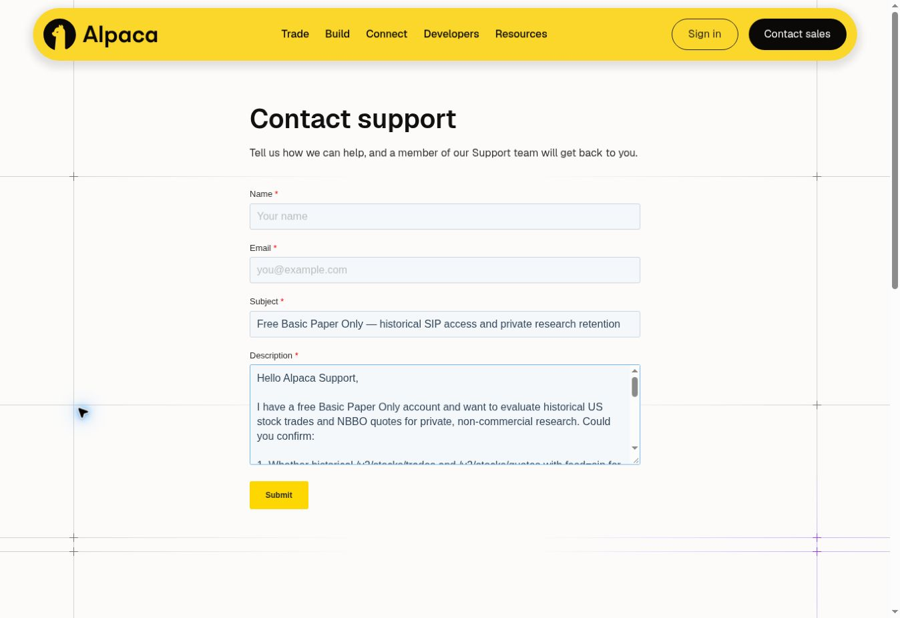

# R335 Alpaca 계정 확인 — 2026-10-10

같은 날 22:09 KST 사용자 승인 후 Paper API 키를 생성하여 비공개 수집기에
연결했다. 등록된 표본의 31 HTTP 요청 모두 200, 체결 674행/호가 812행,
23 terminal pair와 1 page-capped 호가 pair를 관측했다. replay 2회가 동일하다.
추가 비용 $0, 원본·키 비공개, 경제적 라벨 0이다.
[실제 접근 결과와 남은 조건](request335-free-access-result-20261010.md)을 참고한다.
아래 첫 계정 확인 당시의 기록과 미발송 문의 초안은 이전 상태로 보존한다.

사용자가 Alpaca 계정에서 무료 연구에 필요한 확인 작업을 위임했고 직접 보안
로그인을 완료했다. 계정 화면에서 Paper Trading 및 Plans & Features의
`Subscription Status: Basic`, Basic `Included / Current Plan`을 확인했다.
계정 ID, 이메일, API key/secret, 인증 쿠키는 이 기록에 포함하지 않는다.

첫 계정 확인 단계의 추가 지출, 시장 데이터 HTTP 요청, 새 경제적 라벨은 모두 0이었다.
구독 변경, 무료 체험 시작, live 계좌 개설, 주문, 보안 설정 변경은 없다.
기존 407 training / 828 development의 원자료 및 전체 수익성 검증은 계속 막혀 있다.

## 공식 문서로 진행하는 결정 — 같은 날 후속 수정

지원팀의 개별 확인을 무료 접근 표본의 필수 조건으로 둔 판단을 수정한다.
사용자는 공식 지원 범위에서 진행하도록 지시했다. 최신 Market Data API 안내는
Basic을 Paper/Live 계정의 무료 기본 플랜으로 설명하며 IEX 제한을 실시간 데이터에
명시한다. 구체적인 FAQ는 historical `end`가 15분 이상 과거이면 SIP를 구독 없이
조회할 수 있다고 명시한다. 일반 Terms의 개인/비상업 이용 범위와 실제 Basic
계정 확인을 함께 기록하고, 등록된 2026년 5월 기술 표본의 접근 검증을 진행하는
운영 근거로 사용한다. 별도 지원팀 답변이나 공급자의 특별 허가서를 요구하지 않는다.

Paper Only 안내 및 일반 Terms의 미국 거주자 대상 문구는 원래 읽은 상태로 남긴다.
이 기록은 해외 계정의 모든 계약 권리, 영구 보관, 공개 배포, 상업 서비스 이용을
보장하는 법적 확인서가 아니다. 현재 개인 연구용 원본은 비공개로 처리하며 적용
계약을 따른다. 실제 요청이 거부되면 등록된 중단 규칙을 적용한다. 추가 계약이나
별도 이용 범위가 필요한 구체적 문제가 나타날 때만 해당 문제를 확인한다.

문의 초안은 보내지 않는다. 아래 초안과 화면은 이전 판단의 미발송 기록이다.
공식 무료 지원과 실제 source qualification은 별개다. 아직 실제 시장 요청은 0이며
clock/NBBO/units/corrections/order/completeness 검증과 수익성 기준은 바꾸지 않는다.

## API 연결 전 확인 상태 — 이후 접근 결과는 위 후속 기록 참조

| 항목 | 확인 상태 |
|---|---|
| 사용자가 로그인한 실제 Paper 계정 | 확인 |
| 실제 현재 데이터 플랜 Basic | 확인 |
| Basic 플랜의 추가 구독료 없음 | 계정의 Included 표시 및 공식 Terms의 no-cost 설명 확인 |
| 2026년 5월 historical SIP의 실제 계정 접근 | 미실행 / 미확인 |
| 무료 historical SIP 접근의 공식 근거 | 최신 Basic 안내와 구체적인 FAQ를 근거로 등록된 접근 검증 진행; 실제 계정의 응답은 아직 미확인 |
| 개인 연구용 비공개 처리·로컬 재현의 근거 | 일반 Terms의 개인/비상업 이용 범위로 진행; 영구 보관·배포·상업 이용 권리로 확대하지 않음 |
| official NBBO, clock, units, corrections, chronological order | 기존 미확인 상태 유지 |

공식 FAQ는 15분보다 오래된 historical SIP 요청을 구독 없이 허용한다고 설명한다.
Paper Trading 안내는 전 세계 Paper Only 가입을 허용하면서 IEX 이용권으로 설명한다.
일반 Terms는 Basic 무료 및 개인/비상업 이용을 설명하지만 별도의 미국 거주자 대상
문구가 있다. 모든 계약 권리를 인증하는 대신, 위에 명시한 제한된 개인 연구의
운영 근거와 실제 데이터 검증 상태를 구분한다.
원본의 공개 배포·상업 서비스 이용은 현재 위임과 데이터 계약의 범위에 포함하지 않는다.

근거:
- https://docs.alpaca.markets/us/docs/about-market-data-api
- https://docs.alpaca.markets/us/docs/market-data-faq
- https://docs.alpaca.markets/us/docs/paper-trading
- https://alpaca.markets/disclosures
- https://files.alpaca.markets/disclosures/library/TermsAndConditions.pdf

NASDAQ 및 NYSE subscriber agreement 링크는 공개 조회에서 403이 반환되어 해당
파일 내용을 확인하지 못했다. 이 403은 계정의 시장 API 거부 증거가 아니다.

## 이전 공급자 문의 초안 — 미발송 / 진행 조건에서 제외

수신 대상: Alpaca Support. 공식 https://alpaca.markets/support/request 양식에
Subject와 Description만 작성했다. Name/Email은 비워 두었고 Submit은 누르지 않았다.
검토 화면은 아래와 같다.

 용도: 기존 무료 Basic Paper Only 계정의 원자료 권한과
재현 가능한 비공개 보관 확인. API key/secret, 계정 ID, 금융정보, 연구 결과,
원본 시장데이터를 보내지 않는다. 구독이나 구매를 요청하지 않는다.

Subject: Free Basic Paper Only — historical SIP access and private research retention

Hello Alpaca Support,

I have a free Basic Paper Only account and want to evaluate historical US stock
trades and NBBO quotes for private, non-commercial research. Could you confirm:

1. Whether historical /v2/stocks/trades and /v2/stocks/quotes with feed=sip for
   May 5–20, 2026 are available to this account with no additional charge,
   subscription upgrade, or paid trial.
2. Whether the historical SIP permission also applies to non-US Paper Only
   users. The Market Data FAQ describes SIP queries ending over 15 minutes ago
   without a subscription, while the Paper Trading page describes IEX-only rights.
3. Whether original API responses can be retained privately while this account
   remains active and replayed for reproducible personal research, without any
   redistribution. Please identify the applicable data-use/retention terms and
   whether private cloud research processing requires separate permission.

Please do not activate any subscription, trial, purchase, or paid service. This
request is for clarification only.

Thank you.

## 후속 조건

지원팀 답변을 기다리지 않고 필요한 API credential 연결 단계로 진행한다.
확인서의 `rights_evidence_reference`에는 위 공식 URL, 확인일 및 제한된 개인 연구
범위를 기록할 수 있다. 코드도 공급자 편지를 요구하지 않는다. 실제 API 연결은
아직 완료하지 않았으며 시장 원자료나 경제적 결과는 생성되지 않았다.
새 key 생성/재발급은 새 접근권한 또는 기존 credential 변경이므로
해당 동작 직전에 보안 확인 또는 사용자 직접 수행을 거친다. Key를 채팅이나
공개 저장소에 기록하지 않는다. 실제 수집은 이미 고정된 24개 technical pair,
48 HTTP 시도, page/byte/time/denial stop 규칙을 그대로 적용한다.
